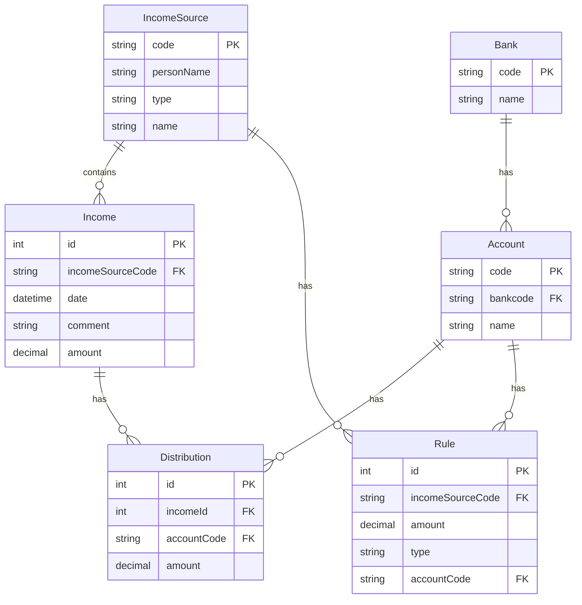

```mermaid
erDiagram
IncomeSource ||--o{ Income : contains
Income ||--o{ Distribution : has
Account ||--o{ Distribution : has
IncomeSource ||--o{ Rule : has
Account ||--o{ Rule : has
Bank ||--o{ Account : has
IncomeSource {
string code PK
string personName
string type
string name
}
Income {
int id PK
string incomeSourceCode FK
datetime date
string comment
decimal amount
}
Rule {
int id PK
string incomeSourceCode FK
decimal amount
string type
string accountCode FK
}
Account {
string code PK
string bankcode FK
string name
}
Bank {
string code PK
string name
}
Distribution {
int id PK
int incomeId FK
string accountCode FK
decimal amount
}
```